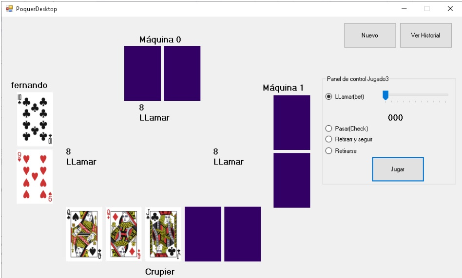

# Laboratorio 2 Guía 1 - Interacción entre objetos (sin herencia)

## Índice

* [Online](#online)
* [Ejercicio 1: TaTeTi](#tateti)
* [Ejercicio 2: Escaleras y serpientes](#escaleras-y-serpientes)
* [Ejercicio 3: Poquer (en construcción)](#poquer)
 
## Online

  
   

  [Ta-Te-Ti Online](http://www.fernandofilipuzziutn.somee.com/)
   

## TaTeTi

Diagrama de clases

 

 

Diagrama de secuencia

## Escaleras y serpientes

Diagrama de clases

  

 

Diagrama de secuencia

  

## Poquer

Diagrama clases

 

Pantallazo

  

